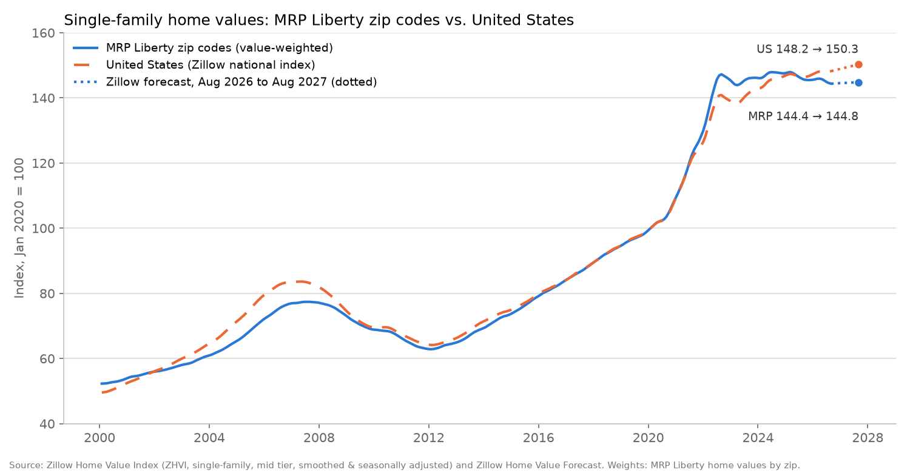

# MRP Liberty homes: Lennar homes bought by Millrose's MRP Liberty LLC

Home-level data on the finished Lennar homes that **MRP Liberty LLC** (a subsidiary of Millrose Properties, Inc.) bought from Lennar entities in Aug–Oct 2026, with purchase prices, last asking prices, time on market, comparable sales and asking rents.

Snapshot: **2026-10-04** (Zillow data added 2026-10-05, Zillow base month Aug 2026). 1,034 homes in 15 states.

## Files

**Zillow home values and forecast for MRP's zip codes:** chart and data in [`zillow/`](zillow/). The indexed history plus forecast is [`zillow/home_value_index_mrp_vs_us.csv`](zillow/home_value_index_mrp_vs_us.csv); the forecast by state and metro is [`zillow/hpa_forecast_summary.csv`](zillow/hpa_forecast_summary.csv).

| File | What it is |
|---|---|
| `mrp_liberty_homes.csv` | One row per home (1,034 rows). |
| `summary_by_state.csv` | State totals and medians, plus an `ALL` row. |
| `mrp_vs_slate_same_house_type.csv` | MRP vs. Slate (another institutional buyer of Lennar homes): same community, same bedrooms, within 10% of the same square footage. |
| `homebuilders/` | 2026 vs. 2025 deliveries and starts for 14 public homebuilders, with sources. See [Homebuilder deliveries and starts](#homebuilder-deliveries-and-starts-2026-vs-2025). |
| `zillow/` | Zillow home price forecasts and home value history for MRP's zip codes. See [Zillow home price analysis](#zillow-home-price-analysis). |

## Headline numbers

| Measure | Result |
|---|---|
| Homes identified | 1,034 (500 with a recorded purchase price) |
| MRP price vs. last asking price | median **−2.8%**, mean −1.6% (289 homes) |
| Days listed for sale before the MRP deed | median **86 days** (229 homes) |
| MRP price vs. same-community comparable sales | **−1.2%** in aggregate (399 homes) |
| MRP vs. Slate, same house type | MRP median −1.9% vs. Slate (7 matched homes; small sample) |
| Homes with an asking rent | 873 |
| Zillow 12-month home price forecast, MRP zip codes (value-weighted) | **+0.3%** vs. +1.4% for the US (Aug 2026 to Aug 2027) |

## Column notes: `mrp_liberty_homes.csv`

- **mrp_price:** from county deed records (stated consideration, deed stamps or assessor sale price; method in `price_source`). **Texas does not disclose sale prices**, so Texas homes have none.
- **evidence:** how the home was tied to MRP Liberty. A = deed seen and matched to the address; B = deed seen, address matched within a batch or not yet resolved; C = weaker evidence.
- **last_list_price / last_list_date:** the last asking price before the home went pending, sold or off market, from MLS price histories (mostly realtor.com price history, plus movoto.com, local MLS broker sites and dated Lennar builder listings). A sale price is never used as a list price, and entries posted at exactly MRP's price after the sale are excluded.
- **list_price_quality:** `one_source`, `two_sources` (two independent sites agree) or `resolved_by_date` (two sites disagreed; the most recent was used).
- **first_list_date / days_listed_before_mrp_deed:** first date the home was offered for sale within the 12 months before the deed, ignoring brief pre-construction listings that came down within 7 days. Days are counted to the deed record date.
- **mrp_vs_last_list_pct:** MRP price ÷ last list price − 1. Negative means MRP paid below the last asking price.
- **comp_value / mrp_vs_comp_pct:** value from Lennar sales to individual buyers in the same community (same plan size where available); `comp_basis` gives the method.
- **asking_rent:** advertised monthly rent on the property manager's public rental listings (Evergreen Live). These are **asking** rents, not signed leases.
- **gross_yield_pct:** asking rent × 12 ÷ MRP price.
- **zillow_fc_1m_pct / zillow_fc_3m_pct / zillow_fc_12m_pct:** Zillow's forecast % change in typical home value for the home's zip code (or its metro if the zip has no forecast) over 1, 3 and 12 months from Aug 31, 2026. `zillow_forecast_source` says which.
- **weight_value / weight_value_basis:** the dollar value used to weight this home in the Zillow averages (see below).
- **zhvi_zip_basis:** which Zillow zip-code home value series this home's weight goes to.

## Caveats

- **Coverage.** Not every MRP purchase may be found. Some deeds recorded in early October 2026 are known only by lot and block (`address` says "lot only").
- **List prices are missing for many homes.** Homes sold before reaching the public MLS have no listing history.
- **Outliers.** About 17 homes show MRP paying more than 10% above the last asking price. Some are probably a different builder's listing at the same address, so the **median** is the more reliable figure.
- **Small samples in some states.** The Slate comparison rests on 7 matched homes.
- **Not investment advice.** Data is compiled from public records and public listing pages and may contain errors. Check against the original sources before relying on it.

## Zillow home price analysis

| Measure | MRP Liberty zip codes | United States |
|---|---|---|
| Zillow forecast, 12 months to Aug 2027 | **+0.3%** (value-weighted) | +1.4% |
| Zillow forecast, 3 months to Nov 2026 | +0.3% | +0.6% |
| Home values, change since Jan 2020 | +44.4% | +48.2% |
| Home values, last 12 months (to Aug 2026) | −0.9% | +1.3% |
| Share of portfolio value where Zillow forecasts a decline | 38% | |

By state, Zillow's 12-month forecast is weakest for Texas (−0.9%, 30% of value) and Florida (−0.8%, 14%), and strongest for Georgia (+2.2%) and Oklahoma (+2.1%). Full breakdown by state and metro: `zillow/hpa_forecast_summary.csv`.

### Files

| File | What it is |
|---|---|
| `zillow/hpa_forecast_summary.csv` | Value-weighted 1-, 3- and 12-month forecasts: all homes, US benchmark, by state, by metro. Also the equal-weighted average, min/max, and share of value with a negative forecast. |
| `zillow/home_value_index_mrp_vs_us.csv` | Monthly index, Jan 2000 to Aug 2026 (Jan 2020 = 100): MRP-weighted zip codes vs. Zillow's US index, plus the US dollar value and how many MRP zips had data each month. The last row is Zillow's forecast for Aug 2027 (`type` column marks actual vs. forecast). |
| `zillow/home_value_index_mrp_vs_us.png` | The chart above. |
| `zillow/zip_weights_and_forecasts.csv` | The 506 zip codes used: MRP homes, dollar weight, weight share, latest Zillow home value and Zillow forecasts. |
| `zillow/zhvi_sfr_monthly_mrp_zips.csv` | Zillow's monthly single-family home value series for those 506 zips, Jan 2000 to Aug 2026 (input to the index). |

### How it is calculated

**1. Weights (how much each home counts).** Each home is weighted by its dollar value, so larger holdings count more:
- the MRP deed price where recorded (500 homes);
- otherwise its last asking price less 1.63%, the average gap between MRP's price and the last asking price (293 homes; mostly Texas, where deed prices are not public);
- otherwise the average MRP deed price for its state (104 homes), or for all states (137 homes).

Total weight: $286 million. Each home's value and method are in `mrp_liberty_homes.csv` (`weight_value`, `weight_value_basis`).

**2. Forecast.** Each home takes the Zillow Home Value Forecast for its zip code (941 homes). Where the zip has no forecast, mostly lot-only deeds without a full address, it takes the forecast for the metro covering its county (93 homes). The portfolio forecast is the value-weighted average:
  `forecast = Σ(weight × zip forecast) ÷ Σ(weight)`.
Equal-weighting the homes gives almost the same answer (+0.29% vs. +0.30%).

**3. Home value index.**
- Each home's weight goes to its zip code's Zillow Home Value Index series. A home whose zip has no Zillow series is split evenly across the Zillow zips in its county.
- Each month, the index moves by the weighted average of the zips' one-month % changes, using only zips with data in both months: `index(t) = index(t−1) × (1 + Σ wᵢ·(ZHVIᵢ(t)/ZHVIᵢ(t−1) − 1) ÷ Σ wᵢ)`.
- Chaining the monthly changes this way means zips that start reporting later (new-build areas) neither drop out nor cause jumps.
- The index is rebased to Jan 2020 = 100. The US line is Zillow's own national index for the same series, rebased the same way.
- The dotted forecast lines extend each series by its 12-month forecast.

**Zillow series used, and why**
- **History:** ZHVI, **single-family homes only**, mid tier (the middle third of home values, 33rd–67th percentile), smoothed and seasonally adjusted. MRP owns single-family homes and townhomes, not condos, and its homes are priced in the middle of their local markets.
- **Forecast:** Zillow Home Value Forecast, smoothed and seasonally adjusted, base month Aug 2026. Zillow publishes forecasts only for single-family and condo homes combined, so the forecast covers a slightly broader set of homes than the history. Zillow also publishes an unadjusted forecast, which shows +1.7% for the US over 12 months.

**Limits.** Zillow's indices and forecasts describe a typical existing home in each zip code, not MRP's new-build homes. Newly built homes can lag the local index when builders cut prices or offer incentives. Zillow revises its forecasts monthly.

### Source data (downloaded Oct 5, 2026)

All from Zillow Research, [zillow.com/research/data](https://www.zillow.com/research/data/):
- **Home Values (ZHVI):** *ZHVI Single-Family Homes Time Series ($)*, mid tier, smoothed and seasonally adjusted, by zip code (`Zip_zhvi_uc_sfr_tier_0.33_0.67_sm_sa_month.csv`) and by metro and US (`Metro_zhvi_uc_sfr_tier_0.33_0.67_sm_sa_month.csv`).
- **Home Value Forecasts (ZHVF):** *ZHVF, all homes (single-family and condo)*, mid tier, smoothed and seasonally adjusted, by zip code (`Zip_zhvf_growth_uc_sfrcondo_tier_0.33_0.67_sm_sa_month.csv`) and by metro and US (`Metro_zhvf_growth_uc_sfrcondo_tier_0.33_0.67_sm_sa_month.csv`).

Zillow data is used with attribution under Zillow's terms of use for its research data. The ZHVI and ZHVF are Zillow's estimates, not appraisals.

## Homebuilder deliveries and starts, 2026 vs. 2025

Context for MRP Liberty's purchases: how much the largest US public homebuilders have cut home deliveries (closings) and starts in 2026. Compiled 2026-10-06 from each builder's latest reported period.

| Builder (FY end) | Period | Deliveries 2026 | 2025 | Change | FY2026 guidance | FY2025 actual | Guidance vs FY2025 |
|---|---|---|---|---|---|---|---|
| D.R. Horton (Sep 30) | Q3 FY26 (9 months to Jun 30 2026) | 61,287 | 61,495 | −0.3% | 83,800-84,300 | 84,863 | −1.0% |
| Lennar (Nov 30) | Q3 FY26 (9 months to Aug 31 2026) | 58,222 | 59,549 | −2.2% | 80,000-81,000 | 82,583 | −2.5% |
| PulteGroup (Dec 31) | Q2 2026 (6 months to Jun 30 2026) | 13,099 | 14,222 | −7.9% | 28,500-29,000 | 29,572 | −2.8% |
| NVR (Dec 31) | Q2 2026 (6 months to Jun 30 2026) | 9,073 | 10,608 | −14.5% | No guidance (NVR does not guide) | 21,915 | n/a |
| Toll Brothers (Oct 31) | Q3 FY26 (9 months to Jul 31 2026) | 7,052 | 7,849 | −10.2% | 10,500-10,600 | 11,292 | −6.6% |
| Taylor Morrison (Dec 31) | Q1 2026 (3 months to Mar 31 2026) - last public release found; acquired by Berkshire Hathaway, closed Jul 24 2026 | 2,268 | 3,048 | −25.6% | approximately 11,000 (given Feb, reaffirmed Apr 2026) | 12,997 | −15.4% |
| Meritage Homes (Dec 31) | Q2 2026 (6 months to Jun 30 2026) | 6,692 | 7,586 | −11.8% | around 5% below FY2025 (cut from flat vs 2025) | 15,026 | −5.0% |
| KB Home (Nov 30) | Q3 FY26 (9 months to Aug 31 2026) | 7,497 | 9,283 | −19.2% | 10,500-11,000 | 12,902 | −16.7% |
| Century Communities (Dec 31) | Q2 2026 (6 months to Jun 30 2026) | 4,519 | 4,871 | −7.2% | 9,750-10,500 | 10,387 | −2.5% |
| M/I Homes (Dec 31) | Q2 2026 (6 months to Jun 30 2026) | 4,120 | 4,324 | −4.7% | No full-year delivery guidance | 8,921 | n/a |
| Dream Finders (Dec 31) | Q2 2026 (6 months to Jun 30 2026) | 4,160 | 4,157 | +0.1% | approximately 9,250 (maintained) | 8,608 | +7.5% |
| LGI Homes (Dec 31) | Q2 2026 (6 months to Jun 30 2026) | 2,356 | 2,319 | +1.6% | 4,600-5,400 | 4,788 | +4.4% |
| Tri Pointe (Dec 31) | Q2 2026 (6 months to Jun 30 2026) | 1,749 | 2,366 | −26.1% | No guidance (acquired by Sumitomo Forestry) | 4,947 | n/a |
| Beazer Homes (Sep 30) | Q3 FY26 (9 months to Jun 30 2026) | 2,353 | 3,021 | −22.1% | Guidance withdrawn (pending Dream Finders acquisition) | 4,427 | n/a |

**Totals.** Year-to-date deliveries for all 14 builders: **184,447 vs. 194,698 (−5.3%)**. Excluding Taylor Morrison, which has only Q1: 182,179 vs. 191,650 (−4.9%). FY2026 guidance midpoints for the 9 builders that give a unit range: **249,975 vs. 257,992 delivered in FY2025 (−3.1%)**. Meritage guides in % terms (about −5%) and is left out of that total.

**Starts.** Most builders don't disclose starts in a form that compares year on year, so there is no total. The like-for-like figures disclosed are:
- D.R. Horton: Q3 FY2026 23,900 vs. 24,700 (−3.2%).
- Meritage: Q2 about 3,900, down 4%.
- PulteGroup: H1 14,378 vs. about 13,920 (+3%; the 2025 figure adds two quarterly numbers, one given as "approximately").
- Lennar reports only a pace: 4.1 starts per community per month in Q3 FY2026.
- Toll says Q3 pre-footing (the start of construction) was up over 30%.

Details are in the `starts_*` columns.

**How it is calculated**
- Every unit count is taken directly from a company press release, SEC exhibit or earnings call.
- Percentages and totals are calculated from those counts. "Guidance vs. FY2025" uses the midpoint of the guidance range.
- Year-to-date periods follow each builder's own financial year. D.R. Horton and Beazer end in September, Toll in October, Lennar and KB Home in November, the rest in December. So the 2026 and 2025 columns always cover the same months for each builder, but not across builders (9 months for some, 6 for others).
- Taylor Morrison was bought by Berkshire Hathaway on Jul 24, 2026 and has no Q2 release, so its row is Q1 only.
- LGI's closings include homes it leases out.
- Nothing is estimated. "Not disclosed" means the company didn't publish it.

**Files**
- `homebuilders/deliveries_starts_2026_vs_2025.csv`: the full table, including starts, the reasons each company gave, and source links.
- `homebuilders/sources.csv`: every source with its type (company release, newswire, SEC exhibit, call transcript, or third-party republication) and publisher.

**Sources by builder.** Company press releases are the primary source; transcripts and republished releases are used only for figures given on calls or where the company page could not be reached:
- **D.R. Horton:** [investor.drhorton.com](https://investor.drhorton.com/~/media/Files/D/D-R-Horton-IR/press-release/dhi-q3-2026-earnings-release.pdf) (company press release (company website)); [fool.com](https://www.fool.com/earnings/call-transcripts/2026/07/22/dr-horton-dhi-q3-2026-earnings-call-transcript/) (earnings call transcript (third-party)); [investor.drhorton.com](https://investor.drhorton.com/~/media/Files/D/D-R-Horton-IR/reports-and-presentations/d-r-horton-3q25-earnings-call-transcript-7-22-2025.pdf) (earnings call transcript (company website)); [investor.drhorton.com](https://investor.drhorton.com/news-and-events/press-releases/2025/10-28-2025-103117295) (company press release (company website))
- **Lennar:** [newsroom.lennar.com](https://newsroom.lennar.com/2026-09-16-Lennar-Reports-Third-Quarter-2026-Results) (company press release (company website)); [fool.com](https://www.fool.com/earnings/call-transcripts/2026/09/17/lennar-len-q3-2026-earnings-call-transcript/) (earnings call transcript (third-party)); [newsroom.lennar.com](https://newsroom.lennar.com/2025-09-18-Lennar-Reports-Third-Quarter-2025-Results) (company press release (company website)); [newsroom.lennar.com](https://newsroom.lennar.com/2025-12-16-Lennar-Reports-Fourth-Quarter-and-Fiscal-2025-Results) (company press release (company website))
- **PulteGroup:** [pultegroupinc.com](https://pultegroupinc.com/investor-relations/news/news-details/2026/PulteGroup-Reports-Second-Quarter-2026-Financial-Results/default.aspx) (company press release (company website)); [stockanalysis.com](https://stockanalysis.com/stocks/phm/transcripts/653558-q2-2026/) (earnings call transcript (third-party)); [fool.com](https://www.fool.com/earnings/call-transcripts/2025/08/05/pultegroup-phm-q2-2025-earnings-call-transcript/) (earnings call transcript (third-party)); [equibles.com](https://equibles.com/stocks/phm/calls/2025-q1) (earnings call transcript (third-party)); [businesswire.com](https://www.businesswire.com/news/home/20260129530503/en/PulteGroup-Reports-Fourth-Quarter-2025-Financial-Results) (company press release (newswire))
- **NVR:** [stocktitan.net](https://www.stocktitan.net/news/NVR/nvr-inc-announces-second-quarter-4sy61qlhfmo4.html) (company press release (republished by third party)); [morningstar.com](https://www.morningstar.com/news/pr-newswire/20260128ph72096/nvr-inc-announces-fourth-quarter-and-full-year-results) (company press release (republished by third party))
- **Toll Brothers:** [globenewswire.com](https://www.globenewswire.com/news-release/2026/08/18/3347263/1924/en/toll-brothers-reports-fy-2026-third-quarter-results.html) (company press release (newswire)); [fool.com](https://www.fool.com/earnings/call-transcripts/2026/08/25/toll-brothers-tol-q3-2026-earnings-call-transcript/) (earnings call transcript (third-party)); [investors.tollbrothers.com](https://investors.tollbrothers.com/news-and-events/press-releases/2025/12-08-2025-213057278) (company press release (company website))
- **Taylor Morrison:** [sec.gov](https://www.sec.gov/Archives/edgar/data/0001562476/000119312526168218/d44208dex991.htm) (SEC filing (company exhibit)); [newsroom.taylormorrison.com](https://newsroom.taylormorrison.com/2026-02-11-Taylor-Morrison-Reports-Fourth-Quarter-and-Full-Year-2025-Results) (company press release (company website)); [investing.com](https://www.investing.com/news/earnings/taylor-morrison-faces-final-earnings-test-as-berkshire-era-begins-93CH-4817605) (news / analysis (third-party))
- **Meritage Homes:** [globenewswire.com](https://www.globenewswire.com/news-release/2026/07/29/3335619/6889/en/Meritage-Homes-reports-second-quarter-2026-results.html) (company press release (newswire)); [theglobeandmail.com](https://www.theglobeandmail.com/investing/markets/stocks/HLT/pressreleases/3730568/meritage-homes-mth-q2-2026-earnings-call-transcript/) (earnings call transcript (third-party)); [investors.meritagehomes.com](https://investors.meritagehomes.com/news-events-presentations/press-releases/detail/427/meritage-homes-reports-fourth-quarter-2025-results) (company press release (company website))
- **KB Home:** [investor.kbhome.com](https://www.investor.kbhome.com/company-news/news-releases/press-release-details/2026/KB-HOME-REPORTS-2026-THIRD-QUARTER-RESULTS/default.aspx) (company press release (company website)); [fool.com](https://www.fool.com/earnings/call-transcripts/2026/09/23/kb-home-kbh-q3-2026-earnings-call-transcript/) (earnings call transcript (third-party)); [investor.kbhome.com](https://investor.kbhome.com/company-news/news-releases/press-release-details/2025/KB-Home-Reports-2025-Fourth-Quarter-and-Full-Year-Results/default.aspx) (company press release (company website))
- **Century Communities:** [stocktitan.net](https://www.stocktitan.net/news/CCS/century-communities-reports-second-quarter-2026-wq8vzf3fv42q.html) (company press release (republished by third party)); [investors.centurycommunities.com](https://investors.centurycommunities.com/news/news-details/2026/Century-Communities-Reports-Fourth-Quarter-and-Full-Year-2025-Results/default.aspx) (company press release (company website))
- **M/I Homes:** [stocktitan.net](https://www.stocktitan.net/news/MHO/m-i-homes-reports-2026-second-quarter-nslfm167mm34.html) (company press release (republished by third party)); [investors.mihomes.com](https://investors.mihomes.com/news-events/press-releases/press-release/2026/MI-Homes-Reports-Fourth-Quarter-and-Year-End-Results/default.aspx) (company press release (company website))
- **Dream Finders:** [investors.dreamfindershomes.com](https://investors.dreamfindershomes.com/news-events/press-releases/detail/64/dream-finders-homes-announces-second-quarter-2026-results) (company press release (company website)); [investors.dreamfindershomes.com](https://investors.dreamfindershomes.com/news-events/press-releases/detail/54/dream-finders-announces-fourth-quarter-and-full-year-2025) (company press release (company website))
- **LGI Homes:** [globenewswire.com](https://www.globenewswire.com/news-release/2026/08/04/3338159/0/en/lgi-homes-inc-reports-strong-second-quarter-2026-results-and-increases-full-year-2026-average-sales-price-and-homebuilding-gross-margin-guidance-ranges.html) (company press release (newswire)); [investor.lgihomes.com](https://investor.lgihomes.com/news-releases/news-release-details/lgi-homes-inc-reports-fourth-quarter-and-full-year-2025-results) (company press release (company website))
- **Tri Pointe:** [globenewswire.com](https://www.globenewswire.com/news-release/2026/08/13/3344965/0/en/tri-pointe-homes-inc-reports-2026-second-quarter-results.html) (company press release (newswire)); [investors.tripointehomes.com](https://investors.tripointehomes.com/newsroom/press-release-details/2026/Tri-Pointe-Homes-Inc--Reports-2025-Fourth-Quarter-and-Full-Year-Results/default.aspx) (company press release (company website))
- **Beazer Homes:** [stocktitan.net](https://www.stocktitan.net/news/BZH/beazer-homes-reports-third-quarter-fiscal-2026-9q5vkwjc17j6.html) (company press release (republished by third party)); [ir.beazer.com](https://ir.beazer.com/news-releases/news-release-details/beazer-homes-reports-fourth-quarter-and-full-fiscal-2025-results) (company press release (company website))

## Sources

County recorder and assessor records (deeds, parcels, stated consideration); realtor.com and movoto.com listing price histories and local MLS broker sites; Lennar.com; Evergreen Live public rental listings (listings.ender.com); okcountyrecords.com and county GIS parcel layers for lot-to-address matching; Zillow Research home value and forecast data ([zillow.com/research/data](https://www.zillow.com/research/data/)).
